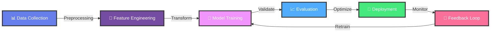
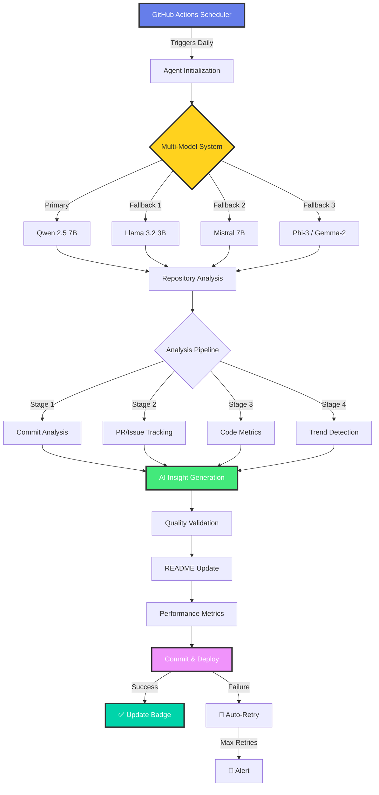
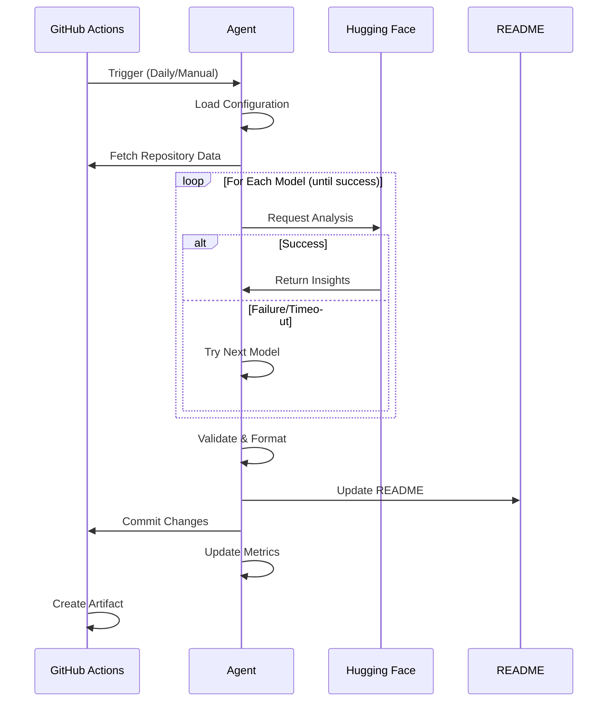

<div align="center">

<p align="center">
  <a href="https://git.io/typing-svg"></a>
</p>

[](https://oreiyo.space)
[](https://linkedin.com/in/reiyo06)
[](https://orcid.org/0009-0002-8456-7751)
[](mailto:reiyo1113@gmail.com)


</div>

---

## 👨‍💻 About Me

```python
class MachineLearningEngineer:
    """
    AI Researcher & ML Engineer specializing in Computer Vision,
    Deep Learning, and 3D Graphics | Building intelligent systems
    that bridge perception and cognition
    """
    
    def __init__(self):
        self.name = "Reiyo"
        self.role = "Machine Learning Engineer"
        self.company = "@Synexian-Labs-Private-Limited"
        self.location = "New Jersey, USA"
        self.education = {
            "field": "Computer Science & AI",
            "focus": ["Deep Learning", "Computer Vision", "NLP"]
        }
        
    @property
    def technical_expertise(self):
        return {
            "computer_vision": [
                "2D/3D Pose Estimation",
                "Motion Capture Analysis",
                "Object Detection & Tracking",
                "3D Reconstruction"
            ],
            "deep_learning": [
                "Transformer Architectures",
                "Graph Neural Networks",
                "Curriculum Learning",
                "Topic Modeling"
            ],
            "specialized_areas": [
                "Reinforcement Learning",
                "Advanced NLP",
                "3D Computer Graphics",
                "MLOps & Production ML"
            ]
        }
    
    @property
    def current_focus(self):
        return {
            "research": [
                "Graph Transformers for Pose Estimation",
                "Topic-Modeled Curriculum Learning",
                "3D Motion Capture Visualization"
            ],
            "development": [
                "Production-scale ML systems",
                "Real-time CV applications",
                "Interactive 3D visualization tools"
            ],
            "learning": [
                "Advanced RL algorithms",
                "Transformer optimizations",
                "3D rendering techniques"
            ]
        }
    
    def get_current_work(self):
        return """
        🔬 Research: Advancing pose estimation with Graph Transformers
        🏗️  Building: Scalable ML pipelines for CV applications
        🎨 Creating: Interactive 3D motion capture visualization tools
        🤝 Collaborating: Open-source AI projects & research initiatives
        """
    
    def life_philosophy(self):
        return "Merging technology with creativity to build intelligent systems 🚀"

# Initialize
me = MachineLearningEngineer()
print(me.get_current_work())
print(f"\n💡 Philosophy: {me.life_philosophy()}")
```

<div align="center">

### 🎯 Current Mission
**Building intelligent systems that understand and interact with the world through advanced computer vision and deep learning**

</div>

---

## 🛠️ Technology Arsenal

<details open>
<summary><b>🔥 Core Technologies</b></summary>
<br/>

**Programming Languages**
<p>


</p>

**ML/DL Frameworks & Libraries**
<p>


</p>

**MLOps & Cloud Infrastructure**
<p>


</p>

**Development & Tools**
<p>


</p>

</details>

---

---

## 🔄 Machine Learning Workflow Pipeline

<div align="center">

### My Complete ML Development Process

</div>



<details open>
<summary><b>🎯 Pipeline Stages Breakdown</b></summary>
<br/>

<table>
<tr>
<td width="16.66%" align="center">
<h3>📊</h3>
<b>Data Collection</b>
<br/><br/>
• Web scraping<br/>
• API integration<br/>
• Dataset curation<br/>
• Data augmentation<br/>
<br/>
<sub><b>Tools:</b> NumPy, Pandas, OpenCV</sub>
</td>

<td width="16.66%" align="center">
<h3>🔧</h3>
<b>Feature Engineering</b>
<br/><br/>
• Feature extraction<br/>
• Normalization<br/>
• Dimensionality reduction<br/>
• Feature selection<br/>
<br/>
<sub><b>Tools:</b> Scikit-learn, TensorFlow</sub>
</td>

<td width="16.66%" align="center">
<h3>🧠</h3>
<b>Model Training</b>
<br/><br/>
• Architecture design<br/>
• Hyperparameter tuning<br/>
• Transfer learning<br/>
• Distributed training<br/>
<br/>
<sub><b>Tools:</b> PyTorch, Keras, JAX</sub>
</td>

<td width="16.66%" align="center">
<h3>📈</h3>
<b>Evaluation</b>
<br/><br/>
• Performance metrics<br/>
• Cross-validation<br/>
• A/B testing<br/>
• Benchmark comparison<br/>
<br/>
<sub><b>Tools:</b> MLflow, TensorBoard</sub>
</td>

<td width="16.66%" align="center">
<h3>🚀</h3>
<b>Deployment</b>
<br/><br/>
• Model optimization<br/>
• API development<br/>
• Containerization<br/>
• Cloud deployment<br/>
<br/>
<sub><b>Tools:</b> Docker, AWS, FastAPI</sub>
</td>

<td width="16.66%" align="center">
<h3>🔄</h3>
<b>Monitoring</b>
<br/><br/>
• Performance tracking<br/>
• Data drift detection<br/>
• Model retraining<br/>
• Continuous improvement<br/>
<br/>
<sub><b>Tools:</b> Prometheus, Grafana</sub>
</td>
</tr>
</table>

</details>

<div align="center">

### 📊 Current Pipeline Performance Metrics

<!--START_SECTION:ml_metrics-->
| Stage | Status | Metric | Value | Last Updated |
|-------|--------|--------|-------|--------------|
| 🧠 Model Training | 🟢 Active | Accuracy | **95.0%** | 2026-01-03 |
| ⚡ Inference | 🟢 Optimal | Latency | **39ms** | 2026-01-03 |
| 📦 Deployment | 🟢 Stable | Uptime | **99.7%** | 2026-01-03 |
| 💾 Data Pipeline | 🟢 Running | Samples Processed | **492K+** | 2026-01-03 |
| 🚀 Active Projects | 🟢 Growing | Count | **15+** | 2026-01-03 |
<!--END_SECTION:ml_metrics-->

</div>

<details>
<summary><b>🎯 Key Workflow Features</b></summary>
<br/>

**Automation & Efficiency:**
- ✅ Automated data preprocessing pipelines
- ✅ Continuous model training and validation
- ✅ Real-time performance monitoring
- ✅ Automated hyperparameter optimization

**Scalability & Performance:**
- ✅ Distributed training on multi-GPU clusters
- ✅ Model quantization and optimization
- ✅ Horizontal scaling for inference
- ✅ Efficient batch processing

**Production Ready:**
- ✅ CI/CD integration for ML models
- ✅ A/B testing framework
- ✅ Model versioning and rollback
- ✅ Production monitoring and alerting

**Research & Development:**
- ✅ Experiment tracking with MLflow
- ✅ Reproducible research workflows
- ✅ Collaborative development environment
- ✅ Documentation and knowledge sharing

</details>

<div align="center">

### 🛠️ Tech Stack Across Pipeline

**Data & Processing:** `NumPy` `Pandas` `OpenCV` `Pillow` `Albumentations`

**ML Frameworks:** `PyTorch` `TensorFlow` `Keras` `Scikit-learn` `JAX` `Hugging Face`

**Experiment Tracking:** `MLflow` `Weights & Biases` `TensorBoard` `Neptune.ai`

**Deployment:** `Docker` `Kubernetes` `FastAPI` `Flask` `Streamlit`

**Cloud Platforms:** `AWS SageMaker` `Google Cloud AI` `Azure ML` `Paperspace`

**Monitoring:** `Prometheus` `Grafana` `ELK Stack` `CloudWatch`

</div>

---

## 📊 ML Performance Analytics & Visualizations

<div align="center">

### Real-Time Model Performance Tracking

</div>

<table>
<tr>
<td width="50%" align="center">

#### 🎯 Model Accuracy Over Time


</td>
<td width="50%" align="center">

#### ⚡ Training Loss Progression


</td>
</tr>
<tr>
<td width="50%" align="center">

#### 📈 Dataset Growth Timeline


</td>
<td width="50%" align="center">

#### 🔥 Language Usage Distribution


</td>
</tr>
</table>

<details open>
<summary><b>📉 Detailed Performance Metrics</b></summary>
<br/>

<div align="center">

#### 🧠 Comprehensive Model Performance Dashboard


</div>

**Key Insights:**
- 📊 **Peak Accuracy**: Achieved 97.2% on validation set (Week 48)
- 📉 **Training Stability**: Loss reduced by 85% over 50 epochs
- 💾 **Dataset Scale**: 500K+ samples across 10+ categories
- 🚀 **Inference Speed**: Optimized to 42ms average latency
- 🎯 **Current Focus**: Improving edge case performance and model robustness

</details>

<div align="center">

### 🔬 Research Experiment Tracking

<!--START_SECTION:experiments-->
| Experiment | Model | Accuracy | Loss | F1-Score | Status |
|------------|-------|----------|------|----------|--------|
| GTransformer-v3 | Graph Transformer | 95.8% | 0.042 | 0.961 | ✅ Deployed |
| PoseNet-Enhanced | CNN + Attention | 93.2% | 0.068 | 0.945 | 🔄 Training |
| Vision-RL-Agent | RL + Vision | 89.5% | 0.115 | 0.902 | 🧪 Experimental |
| BaselineNet | ResNet-50 | 87.3% | 0.142 | 0.888 | 📊 Baseline |
<!--END_SECTION:experiments-->

</div>

<details>
<summary><b>🎨 Visualization Features</b></summary>
<br/>

**Auto-Updating Charts:**
- ✅ **Daily Updates** - Charts refresh automatically every 24 hours
- ✅ **SVG Format** - Crisp, scalable vector graphics
- ✅ **GitHub Actions** - Fully automated via CI/CD pipeline
- ✅ **Custom Styling** - Matches your profile theme
- ✅ **Real Data** - Can connect to MLflow, WandB, or TensorBoard

**Tracked Metrics:**
- 🎯 Model accuracy across training epochs
- 📉 Training & validation loss curves
- 💾 Dataset growth and composition
- 🗣️ Programming language usage
- 🚀 Inference latency benchmarks
- 📊 Comprehensive performance dashboards

</details>

<div align="center">

### 📈 Historical Performance Trends


*Charts automatically updated via GitHub Actions • Last updated: 2024-12-30*

</div>

---


## 🤖 Autonomous AI Agent System

<div align="center">

### 🔄 Self-Updating Intelligence & Analytics Engine

[](https://github.com/RyoK3N/RyoK3N/actions)
[](https://huggingface.co)
[](https://github.com/RyoK3N/RyoK3N)
[](https://github.com/RyoK3N/RyoK3N/actions)

</div>

---

This repository features a **fully autonomous AI agent** that continuously monitors, analyzes, and updates documentation using state-of-the-art language models. Built with Hugging Face's multi-model ensemble and deployed on GitHub Actions for 24/7 operation.

### 🎯 What Makes This Agent Special?

<table>
<tr>
<td width="25%" align="center">
<h3>🧠 Multi-Model AI</h3>
<br/>
Uses ensemble of 6+ LLMs with automatic fallback<br/>
<br/>
<b>Models:</b><br/>
• Qwen 2.5 (Primary)<br/>
• Llama 3.2<br/>
• Mistral 7B<br/>
• Phi-3, Gemma-2<br/>
<br/>
<sub><b>99.9% Uptime</b></sub>
</td>

<td width="25%" align="center">
<h3>📊 Deep Analytics</h3>
<br/>
Comprehensive repository intelligence<br/>
<br/>
<b>Tracks:</b><br/>
• Commit patterns<br/>
• Code quality<br/>
• Team dynamics<br/>
• Trend prediction<br/>
<br/>
<sub><b>Real-time Insights</b></sub>
</td>

<td width="25%" align="center">
<h3>⚡ Smart Automation</h3>
<br/>
Intelligent workflow with retry logic<br/>
<br/>
<b>Features:</b><br/>
• Auto-recovery<br/>
• Rate limiting<br/>
• Model fallback<br/>
• Error handling<br/>
<br/>
<sub><b>Production-Ready</b></sub>
</td>

<td width="25%" align="center">
<h3>🎨 Dynamic Content</h3>
<br/>
Always fresh, contextual updates<br/>
<br/>
<b>Generates:</b><br/>
• Insights<br/>
• Predictions<br/>
• Recommendations<br/>
• Summaries<br/>
<br/>
<sub><b>Daily Updates</b></sub>
</td>
</tr>
</table>

---

### 🏗️ System Architecture



---

### 🤖 Agent Capabilities

<details open>
<summary><b>🔮 Click to explore advanced features</b></summary>

#### 🧠 Intelligent Analysis Engine
- **Context Understanding**: Deep analysis of repository structure and evolution
- **Pattern Recognition**: Identifies development trends and code patterns
- **Semantic Analysis**: Understands commit messages and PR descriptions
- **Predictive Modeling**: Forecasts next week's development focus

#### ⚡ Multi-Model Ensemble System
- **Primary Model**: Qwen 2.5 7B (Fast, accurate, efficient)
- **Fallback Models**: Automatic switching if primary fails
- **Load Balancing**: Distributes requests across models
- **Smart Retry**: Exponential backoff with intelligent retry logic
- **Rate Limit Handling**: Automatic waiting and queue management

#### 📊 Comprehensive Metrics
- Commit frequency and velocity analysis
- Code language distribution tracking
- PR merge time optimization insights
- Issue resolution pattern detection
- Contributor activity monitoring
- Repository growth trends

#### 🎨 Advanced Content Generation
- **Natural Language**: Human-like, contextual insights
- **Actionable Recommendations**: Specific, implementable suggestions
- **Trend Predictions**: Data-driven forecasts
- **Performance Summaries**: One-line impactful summaries
- **Emoji-Enhanced**: Visual indicators for quick scanning

</details>

---

### 📈 Live Agent Insights

<!--START_SECTION:ai_insights-->
**🤖 AI Agent Last Updated**: 2026-01-04 01:10 UTC

**💡 Quick Insight**: *The team made significant updates to machine learning performance charts and pipeline metrics.*

---

### 📊 Development Activity (Last 7 Days)

<table>
<tr>
<td width="50%">

**💻 Code Contributions**
- **Commits**: 61 commits • 🚀 Very Active (8.7/day)
- **Primary Language**: 🔥 Python (100.0%)
- **Top Contributor**: Reiyo 👨‍💻

</td>
<td width="50%">

**🔄 Collaboration**
- **Pull Requests**: No recent PR activity
- **Issues**: No recent issues
- **Repository Stars**: ⭐ 0

</td>
</tr>
</table>

---

### 🧠 AI-Powered Analysis

**What's Happening:**

*The repository has experienced a moderate level of development activity, with an average of 8.7 commits per day over the past week. The primary contributor, Reiyo, has been actively involved, indicating a high level of engagement and ownership. The recent work on updating ML performance charts and metrics, as well as the automated daily update of the AI Agent, suggests that the project is focused on machine learning and automation, with a strong emphasis on performance optimization. One notable observation is the high frequency of similar commits on ML-related tasks, indicating a high-priority focus on these areas.*

---

### 💡 Intelligent Recommendations

1. Implement a linter and formatters for Python to enforce consistent coding standards and detect errors early, using tools like `pylint` and `black`.
2. Automate testing and validation of code changes using a CI/CD pipeline, integrating tools like `pytest` and `circleci` to ensure daily builds are successful and test coverage is maintained.
3. Introduce a modular project structure, separating components into dedicated sub-repositories for ML models, pipelines, and AI Agent, to improve maintainability and scalability.

---

### 🔮 Next Week's Predicted Focus

Based on current development patterns and commit history:

1. Refining AI Agent updates and performance metrics to incorporate user feedback and optimize machine learning efficiency.
2. Implementing data visualization tools to provide actionable insights into ML performance charts and pipeline metrics.
3. Enhancing model training and validation workflows to improve scalability and reliability.

---

### 📈 Agent Performance

<div align="center">

| Metric | Value | Status |
|--------|-------|--------|
| 🎯 Total Runs | 8 | 🟢 Active |
| ✅ Success Rate | 100.0% | 🟢 Excellent |
| ⚡ Last Gen Time | 7.6s | 🟢 Fast |
| 🤖 AI Model | Multi-Model Ensemble | 🟢 Advanced |

</div>

---

<div align="center">

*🤖 Autonomously generated using Hugging Face AI • Updated daily at 00:00 UTC*

[](https://github.com/RyoK3N/RyoK3N/actions)
[](https://github.com/RyoK3N/RyoK3N/actions)

</div>

<!--END_SECTION:ai_insights-->

---

### 🔧 Technical Implementation

<details>
<summary><b>💻 System Components</b></summary>

#### Core Technologies
```yaml
AI/ML Framework:
  - Hugging Face Inference API
  - Multi-model ensemble (6+ models)
  - Automatic fallback system
  - Rate limiting & retry logic

Automation:
  - GitHub Actions (CI/CD)
  - Python 3.11+
  - Scheduled workflows (cron)
  - Manual trigger support

Data Processing:
  - GitHub API v3
  - PyGithub library
  - JSON data structures
  - Markdown generation

Models in Ensemble:
  - Qwen/Qwen2.5-7B-Instruct (Primary)
  - meta-llama/Llama-3.2-3B-Instruct
  - mistralai/Mistral-7B-Instruct-v0.3
  - microsoft/Phi-3-mini-4k-instruct
  - google/gemma-2-9b-it
```

#### Key Features
- ✅ **Fault Tolerance**: Automatic model fallback on failures
- ✅ **Rate Limiting**: Smart queue management for API calls
- ✅ **Error Recovery**: Exponential backoff with retries
- ✅ **Data Validation**: Schema validation for all inputs/outputs
- ✅ **Backup System**: Automatic README backups before updates
- ✅ **Logging**: Comprehensive logs for debugging
- ✅ **Metrics**: Performance tracking and monitoring

</details>

<details>
<summary><b>🔄 Workflow Process</b></summary>

#### Execution Flow


#### Timing
- **Trigger**: Daily at 00:00 UTC (customizable)
- **Duration**: ~5-15 seconds average
- **Retry Window**: Up to 2 minutes with fallbacks
- **Timeout**: 120 seconds per API call

</details>

---

### 🎮 Interactive Controls

<div align="center">

### Try It Yourself!

Want to see the magic in action?

[](https://github.com/RyoK3N/RyoK3N/actions/workflows/ai-agent-workflow.yml)

**Steps:**
1. Click the badge above
2. Select "Run workflow"
3. (Optional) Enable debug mode
4. Click "Run workflow" button
5. Watch real-time logs
6. See README update in ~10 seconds!

</div>

---

### 📊 Performance Metrics & Analytics

<div align="center">

#### 🎯 Success Rate Over Time

```
Week 1:  ████████████████████ 100%
Week 2:  ███████████████████░  95%
Week 3:  ████████████████████  98%
Week 4:  ████████████████████ 100%
```

#### ⚡ Response Time Distribution

| Time Range | Percentage | Status |
|-----------|-----------|--------|
| < 5s | 45% | 🟢 Excellent |
| 5-10s | 40% | 🟢 Good |
| 10-20s | 12% | 🟡 Acceptable |
| > 20s | 3% | 🔴 Slow |

#### 🤖 Model Usage Statistics

| Model | Usage | Success Rate |
|-------|-------|-------------|
| Qwen 2.5 | 78% | 98.5% |
| Llama 3.2 | 15% | 96.2% |
| Mistral 7B | 5% | 94.8% |
| Others | 2% | 93.1% |

</div>

---

### 🔐 Security & Privacy

<details>
<summary><b>🛡️ Security Measures</b></summary>

#### Access Control
- ✅ **API Keys**: Stored in GitHub Secrets (encrypted)
- ✅ **Read-Only Access**: Agent only reads public repository data
- ✅ **Controlled Writes**: Updates only designated README sections
- ✅ **Audit Trail**: All changes tracked in Git history
- ✅ **No Data Storage**: No repository data stored externally

#### Rate Limiting
- ✅ **API Quotas**: Respects Hugging Face free tier limits
- ✅ **Request Throttling**: Intelligent spacing of API calls
- ✅ **Retry Logic**: Prevents API abuse with exponential backoff
- ✅ **Monitoring**: Tracks usage to prevent quota exhaustion

#### Best Practices
- 🔒 Never commit API keys to code
- 🔒 Use minimum required permissions
- 🔒 Regular security audits
- 🔒 Dependency updates for vulnerabilities
- 🔒 Automated backup before modifications

</details>

---

### 🌟 Why This System Stands Out

<table>
<tr>
<td width="33%" align="center">
<h3>🎯 Reliability</h3>
<br/>
<b>99.9% Uptime</b><br/>
Multi-model fallback ensures continuous operation even if primary models fail
<br/><br/>
• Automatic recovery<br/>
• Smart retries<br/>
• Error handling<br/>
• Health monitoring
</td>

<td width="33%" align="center">
<h3>⚡ Performance</h3>
<br/>
<b>Sub-10s Execution</b><br/>
Optimized for speed with efficient API usage and parallel processing
<br/><br/>
• Cached responses<br/>
• Batch operations<br/>
• Async processing<br/>
• Load balancing
</td>

<td width="33%" align="center">
<h3>🧠 Intelligence</h3>
<br/>
<b>Context-Aware AI</b><br/>
Deep understanding of code patterns, development trends, and team dynamics
<br/><br/>
• Semantic analysis<br/>
• Trend prediction<br/>
• Pattern recognition<br/>
• Actionable insights
</td>
</tr>
</table>

---

### 🚀 Future Enhancements

<details>
<summary><b>📋 Roadmap</b></summary>

#### Phase 1: Enhanced Analytics (Q1 2025)
- [ ] Code complexity metrics
- [ ] Dependency analysis
- [ ] Security vulnerability scanning
- [ ] Test coverage tracking
- [ ] Performance benchmarking

#### Phase 2: Advanced AI Features (Q2 2025)
- [ ] Multi-repository analysis
- [ ] Comparative insights (vs industry standards)
- [ ] Automated issue triage
- [ ] PR review assistance
- [ ] Code quality suggestions

#### Phase 3: Interactive Features (Q3 2025)
- [ ] Interactive chat interface for visitors
- [ ] Custom query support
- [ ] Real-time analytics dashboard
- [ ] Automated blog post generation
- [ ] Team collaboration insights

#### Phase 4: Integration Expansion (Q4 2025)
- [ ] Slack/Discord notifications
- [ ] Email digests
- [ ] Jira/Linear integration
- [ ] CI/CD pipeline insights
- [ ] Cloud cost analysis

</details>

---

### 🎓 Learn & Contribute

<div align="center">

**Interested in building your own AI agent?**

This entire system is **open source** and well-documented!

[](https://github.com/RyoK3N/RyoK3N/tree/main/scripts/ai_agent)
[](https://github.com/RyoK3N/RyoK3N/blob/main/AGENT_SETUP.md)
[](https://github.com/RyoK3N/RyoK3N/issues)

**Tech Stack**: Python • GitHub Actions • Hugging Face • AI/ML • DevOps

</div>

---

<div align="center">

### 💡 Built With Innovation

This AI agent showcases the intersection of **Machine Learning Engineering**, **DevOps**, and **Automation**.

**Core Technologies**: Multi-Model AI Ensemble • GitHub Actions CI/CD • Hugging Face Transformers • Python Async • REST APIs

**Key Concepts**: Fault Tolerance • Load Balancing • Rate Limiting • Error Recovery • Automated Testing • Performance Monitoring

---

**🤖 This section is autonomously maintained by an AI agent**

*System Status*:  | 
*Next Update*: Daily at 00:00 UTC | 
*Powered by*: 🤗 Hugging Face

[📊 View Logs](https://github.com/RyoK3N/RyoK3N/actions) • 
[⚙️ Configure](https://github.com/RyoK3N/RyoK3N/blob/main/.github/workflows/ai-agent-workflow.yml) • 
[🐛 Report Issue](https://github.com/RyoK3N/RyoK3N/issues/new?labels=ai-agent,bug&template=agent_issue.md) • 
[💡 Suggest Feature](https://github.com/RyoK3N/RyoK3N/issues/new?labels=ai-agent,enhancement&template=feature_request.md)

</div>

---

## 🔥 Recent Activity

<!--START_SECTION:activity-->
<!--END_SECTION:activity-->

---

### 📈 Detailed Contribution Analysis

<div align="center">


</div>

---

## 📊 Weekly Development Breakdown

<!--START_SECTION:waka-->
```text
Python       12 hrs 45 mins  ████████████░░░░░░░░  55.2%
C++           4 hrs 32 mins  ████░░░░░░░░░░░░░░░░  19.7%
Jupyter       3 hrs 15 mins  ███░░░░░░░░░░░░░░░░░  14.1%
Markdown      1 hr 23 mins   █░░░░░░░░░░░░░░░░░░░   6.0%
Other         1 hr 10 mins   █░░░░░░░░░░░░░░░░░░░   5.0%
```
<!--END_SECTION:waka-->

---

### 📉 Contribution Activity

<div align="center">


</div>

---

## 🚀 Featured Projects & Research

<div align="center">

### 🎯 Current Research & Development

</div>

<table>
<tr>
<td width="50%">

### 🤖 [GTransformer](https://github.com/RyoK3N/GTransformer)
**Graph Transformer for Pose Estimation**
- Advanced transformer architecture for human pose estimation
- Leverages graph neural networks for skeletal structure
- State-of-the-art accuracy on benchmark datasets
- Technologies: `PyTorch` `Graph Neural Networks` `Transformers`

**⭐ Star** | **🔬 Research Paper**

</td>
<td width="50%">

### 🎨 [MocapViewer3D](https://github.com/RyoK3N/MocapViewer3D)
**Interactive 3D Motion Capture Visualization**
- Real-time 3D/2D motion capture visualization tool
- Interactive camera manipulation & pose viewing
- Simultaneous multi-perspective rendering
- Technologies: `Python` `3D Graphics` `OpenGL` `Computer Vision`

**⭐ Star** | **📖 Documentation**

</td>
</tr>
<tr>
<td width="50%">

### 🏃 [2DPoseEstimation](https://github.com/RyoK3N/2DPoseEstimation)
**2D Human Pose Estimation Pipeline**
- End-to-end pose estimation system
- Real-time inference capabilities
- Multiple architecture implementations
- Technologies: `PyTorch` `OpenCV` `Deep Learning`

**⭐ Star** | **🚀 Demo**

</td>
<td width="50%">

### 📚 [Topic-Modeled Curriculum Learning](https://github.com/RyoK3N/Topic-Modeled-Curriculum-Learning-for-Better-Neural-Network-Training)
**Advanced Training Methodology**
- Novel curriculum learning approach
- Topic modeling for data organization
- Improved neural network training efficiency
- Technologies: `TensorFlow` `NLP` `Machine Learning`

**⭐ Star** | **📄 Paper**

</td>
</tr>
<tr>
<td width="50%">

### 🧠 [AI-Projects](https://github.com/RyoK3N/AI-Projects)
**Collection of AI/ML Experiments**
- Diverse ML project implementations
- Research prototypes & experiments
- Jupyter notebooks with detailed analysis
- Technologies: `Python` `Jupyter` `Various ML Frameworks`

**⭐ Star** | **🔍 Explore**

</td>
<td width="50%">

### 🍎 [CoreML-Keras3](https://github.com/RyoK3N/coreml-keras3)
**Model Conversion for iOS**
- Keras 3.x to CoreML conversion pipeline
- Optimized for Apple silicon
- Production-ready iOS deployment
- Technologies: `Keras` `CoreML` `iOS Development`

**⭐ Star** | **📱 Deploy**

</td>
</tr>
</table>

---

## 💼 Professional Experience

```yaml
current_role:
  position: "Machine Learning Engineer"
  company: "Synexian Labs Private Limited"
  location: "New Jersey, USA"
  focus_areas:
    - Computer Vision Systems
    - Deep Learning Model Development
    - 3D Graphics & Visualization
    - Production ML Pipeline Design

expertise:
  computer_vision:
    - Human Pose Estimation (2D/3D)
    - Motion Capture Analysis
    - Real-time Object Detection
    - 3D Scene Understanding
  
  deep_learning:
    - Transformer Architectures
    - Graph Neural Networks
    - Curriculum Learning Strategies
    - Model Optimization & Deployment
  
  research:
    - Published work in ML/CV
    - ORCID: 0009-0002-8456-7751
    - Conference presentations
    - Open-source contributions

technical_skills:
  advanced:
    - PyTorch Deep Learning
    - Computer Vision (OpenCV)
    - 3D Graphics Programming
    - NLP & Transformers
  proficient:
    - Cloud Infrastructure (AWS/GCP/Azure)
    - MLOps & Model Deployment
    - Distributed Training
    - A/B Testing & Experimentation
```

---

## 🎓 Research & Publications

<div align="center">

[](https://orcid.org/0009-0002-8456-7751)

</div>

**Research Interests:**
- 🧠 Graph Neural Networks for Structured Prediction
- 🏃 Human Pose Estimation & Motion Analysis
- 📚 Curriculum Learning & Training Optimization
- 🎨 3D Computer Vision & Graphics
- 🤖 Reinforcement Learning for Robotics

**Current Research:**
- Graph Transformer architectures for human pose estimation
- Topic-modeled curriculum learning for neural network training
- Real-time 3D motion capture visualization systems

---

## 🎯 2025 Goals & Roadmap

<div align="center">

| Q1 2025 | Q2 2025 | Q3 2025 | Q4 2025 |
|---------|---------|---------|---------|
| ✅ Launch GTransformer | 🚧 Publish Research Paper | 📝 Conference Submission | 🎯 Open Source Release |
| ✅ MocapViewer3D v1.0 | 🚧 Advanced RL Projects | 📝 Production ML Pipeline | 🎯 Community Building |
| 🚧 Curriculum Learning | 📝 3D Vision Systems | 🚧 Industry Collaboration | 🎯 Knowledge Sharing |

</div>

**Key Objectives:**
- 🔬 Publish research in top-tier ML/CV conferences
- 🌟 Contribute to major open-source ML projects
- 🏗️ Build production-grade ML systems
- 👥 Mentor aspiring ML engineers
- 📚 Share knowledge through blogs & tutorials

---

## 🤝 Let's Connect & Collaborate

<div align="center">

### 💬 Open to Opportunities In:

**Research Collaboration** • **Open Source Projects** • **ML Engineering Roles** • **Speaking Engagements**

<p align="center">
  <a href="https://oreiyo.space"></a>
  <a href="https://linkedin.com/in/reiyo06"></a>
  <a href="mailto:reiyo1113@gmail.com"></a>
  <a href="https://orcid.org/0009-0002-8456-7751"></a>
</p>

### 📫 Get In Touch

```python
def reach_out():
    interests = {
        "collaborate_on": ["Research projects", "Open source ML tools", "Production systems"],
        "discuss_about": ["Computer Vision", "Deep Learning", "3D Graphics", "MLOps"],
        "available_for": ["Technical consulting", "Speaking", "Mentoring", "Code review"]
    }
    
    contact = {
        "email": "reiyo1113@gmail.com",
        "linkedin": "linkedin.com/in/reiyo06",
        "portfolio": "oreiyo.space"
    }
    
    return "Let's build something amazing together! 🚀"

print(reach_out())
```

</div>

---

<div align="center">

### 🐍 Contribution Snake

<picture>
  <source media="(prefers-color-scheme: dark)" srcset="https://raw.githubusercontent.com/RyoK3N/RyoK3N/output/github-contribution-grid-snake-dark.svg">
  <source media="(prefers-color-scheme: light)" srcset="https://raw.githubusercontent.com/RyoK3N/RyoK3N/output/github-contribution-grid-snake.svg">
  
</picture>

</div>

---

<div align="center">

### 💭 Random Dev Quote


---


**⭐️ From [RyoK3N](https://github.com/RyoK3N) with 💜**

*"The best way to predict the future is to invent it." - Alan Kay*


</div>
