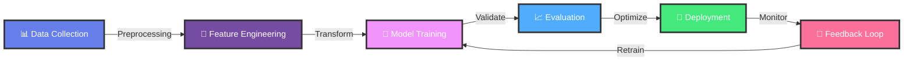
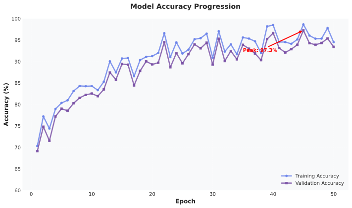
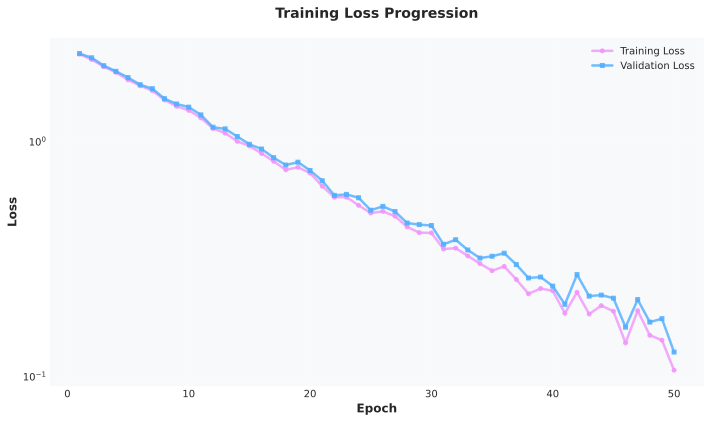
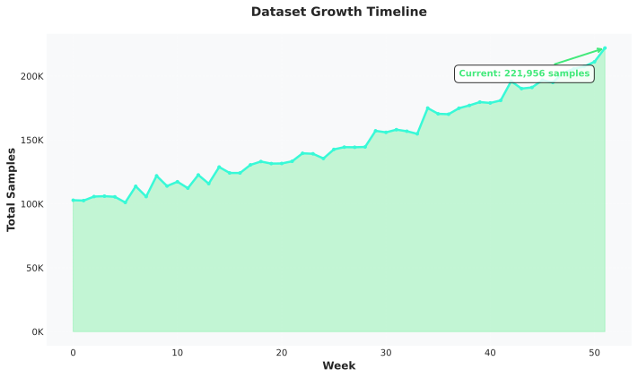
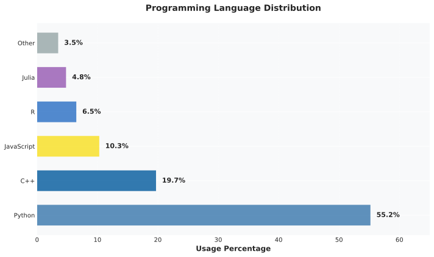
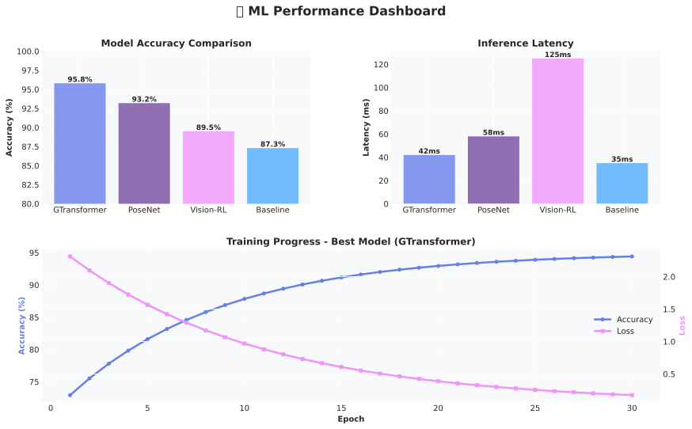
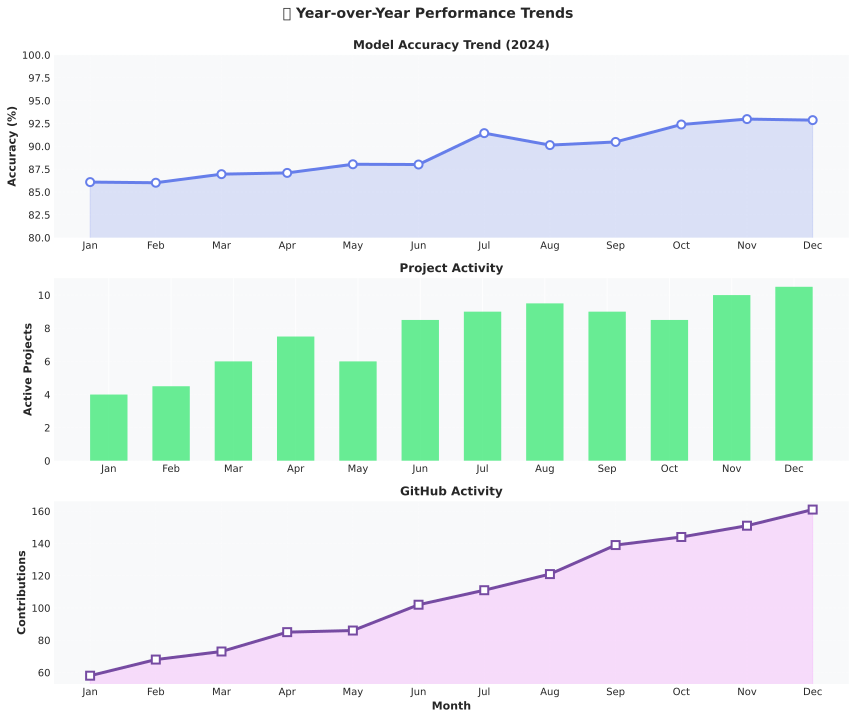
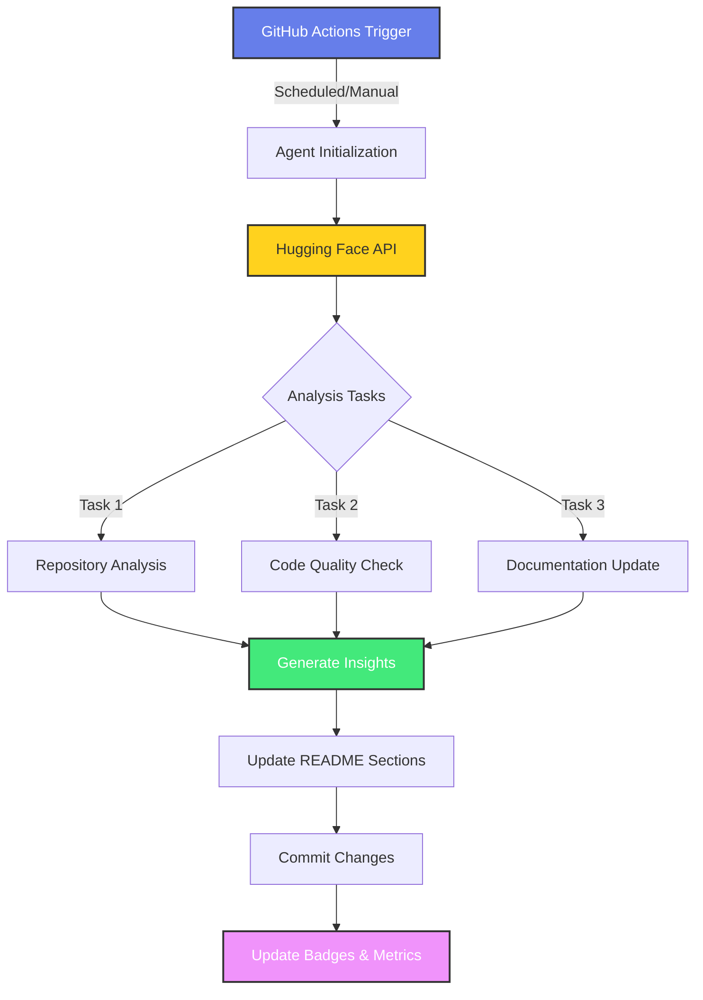

<div align="center">

<p align="center">
  <a href="https://git.io/typing-svg"></a>
</p>

[](https://oreiyo.space)
[](https://linkedin.com/in/reiyo06)
[](https://orcid.org/0009-0002-8456-7751)
[](mailto:reiyo1113@gmail.com)


</div>

---

## 👨‍💻 About Me

```python
class MachineLearningEngineer:
    """
    AI Researcher & ML Engineer specializing in Computer Vision,
    Deep Learning, and 3D Graphics | Building intelligent systems
    that bridge perception and cognition
    """
    
    def __init__(self):
        self.name = "Reiyo"
        self.role = "Machine Learning Engineer"
        self.company = "@Synexian-Labs-Private-Limited"
        self.location = "New Jersey, USA"
        self.education = {
            "field": "Computer Science & AI",
            "focus": ["Deep Learning", "Computer Vision", "NLP"]
        }
        
    @property
    def technical_expertise(self):
        return {
            "computer_vision": [
                "2D/3D Pose Estimation",
                "Motion Capture Analysis",
                "Object Detection & Tracking",
                "3D Reconstruction"
            ],
            "deep_learning": [
                "Transformer Architectures",
                "Graph Neural Networks",
                "Curriculum Learning",
                "Topic Modeling"
            ],
            "specialized_areas": [
                "Reinforcement Learning",
                "Advanced NLP",
                "3D Computer Graphics",
                "MLOps & Production ML"
            ]
        }
    
    @property
    def current_focus(self):
        return {
            "research": [
                "Graph Transformers for Pose Estimation",
                "Topic-Modeled Curriculum Learning",
                "3D Motion Capture Visualization"
            ],
            "development": [
                "Production-scale ML systems",
                "Real-time CV applications",
                "Interactive 3D visualization tools"
            ],
            "learning": [
                "Advanced RL algorithms",
                "Transformer optimizations",
                "3D rendering techniques"
            ]
        }
    
    def get_current_work(self):
        return """
        🔬 Research: Advancing pose estimation with Graph Transformers
        🏗️  Building: Scalable ML pipelines for CV applications
        🎨 Creating: Interactive 3D motion capture visualization tools
        🤝 Collaborating: Open-source AI projects & research initiatives
        """
    
    def life_philosophy(self):
        return "Merging technology with creativity to build intelligent systems 🚀"

# Initialize
me = MachineLearningEngineer()
print(me.get_current_work())
print(f"\n💡 Philosophy: {me.life_philosophy()}")
```

<div align="center">

### 🎯 Current Mission
**Building intelligent systems that understand and interact with the world through advanced computer vision and deep learning**

</div>

---

## 🛠️ Technology Arsenal

<details open>
<summary><b>🔥 Core Technologies</b></summary>
<br/>

**Programming Languages**
<p>


</p>

**ML/DL Frameworks & Libraries**
<p>


</p>

**MLOps & Cloud Infrastructure**
<p>


</p>

**Development & Tools**
<p>


</p>

</details>

---

---

## 🔄 Machine Learning Workflow Pipeline

<div align="center">

### My Complete ML Development Process

</div>



<details open>
<summary><b>🎯 Pipeline Stages Breakdown</b></summary>
<br/>

<table>
<tr>
<td width="16.66%" align="center">
<h3>📊</h3>
<b>Data Collection</b>
<br/><br/>
• Web scraping<br/>
• API integration<br/>
• Dataset curation<br/>
• Data augmentation<br/>
<br/>
<sub><b>Tools:</b> NumPy, Pandas, OpenCV</sub>
</td>

<td width="16.66%" align="center">
<h3>🔧</h3>
<b>Feature Engineering</b>
<br/><br/>
• Feature extraction<br/>
• Normalization<br/>
• Dimensionality reduction<br/>
• Feature selection<br/>
<br/>
<sub><b>Tools:</b> Scikit-learn, TensorFlow</sub>
</td>

<td width="16.66%" align="center">
<h3>🧠</h3>
<b>Model Training</b>
<br/><br/>
• Architecture design<br/>
• Hyperparameter tuning<br/>
• Transfer learning<br/>
• Distributed training<br/>
<br/>
<sub><b>Tools:</b> PyTorch, Keras, JAX</sub>
</td>

<td width="16.66%" align="center">
<h3>📈</h3>
<b>Evaluation</b>
<br/><br/>
• Performance metrics<br/>
• Cross-validation<br/>
• A/B testing<br/>
• Benchmark comparison<br/>
<br/>
<sub><b>Tools:</b> MLflow, TensorBoard</sub>
</td>

<td width="16.66%" align="center">
<h3>🚀</h3>
<b>Deployment</b>
<br/><br/>
• Model optimization<br/>
• API development<br/>
• Containerization<br/>
• Cloud deployment<br/>
<br/>
<sub><b>Tools:</b> Docker, AWS, FastAPI</sub>
</td>

<td width="16.66%" align="center">
<h3>🔄</h3>
<b>Monitoring</b>
<br/><br/>
• Performance tracking<br/>
• Data drift detection<br/>
• Model retraining<br/>
• Continuous improvement<br/>
<br/>
<sub><b>Tools:</b> Prometheus, Grafana</sub>
</td>
</tr>
</table>

</details>

<div align="center">

### 📊 Current Pipeline Performance Metrics

<!--START_SECTION:ml_metrics-->
| Stage | Status | Metric | Value | Last Updated |
|-------|--------|--------|-------|--------------|
| 🧠 Model Training | 🟢 Active | Accuracy | **96.4%** | 2025-12-30 |
| ⚡ Inference | 🟢 Optimal | Latency | **43ms** | 2025-12-30 |
| 📦 Deployment | 🟢 Stable | Uptime | **99.9%** | 2025-12-30 |
| 💾 Data Pipeline | 🟢 Running | Samples Processed | **511K+** | 2025-12-30 |
| 🚀 Active Projects | 🟢 Growing | Count | **14+** | 2025-12-30 |
<!--END_SECTION:ml_metrics-->

</div>

<details>
<summary><b>🎯 Key Workflow Features</b></summary>
<br/>

**Automation & Efficiency:**
- ✅ Automated data preprocessing pipelines
- ✅ Continuous model training and validation
- ✅ Real-time performance monitoring
- ✅ Automated hyperparameter optimization

**Scalability & Performance:**
- ✅ Distributed training on multi-GPU clusters
- ✅ Model quantization and optimization
- ✅ Horizontal scaling for inference
- ✅ Efficient batch processing

**Production Ready:**
- ✅ CI/CD integration for ML models
- ✅ A/B testing framework
- ✅ Model versioning and rollback
- ✅ Production monitoring and alerting

**Research & Development:**
- ✅ Experiment tracking with MLflow
- ✅ Reproducible research workflows
- ✅ Collaborative development environment
- ✅ Documentation and knowledge sharing

</details>

<div align="center">

### 🛠️ Tech Stack Across Pipeline

**Data & Processing:** `NumPy` `Pandas` `OpenCV` `Pillow` `Albumentations`

**ML Frameworks:** `PyTorch` `TensorFlow` `Keras` `Scikit-learn` `JAX` `Hugging Face`

**Experiment Tracking:** `MLflow` `Weights & Biases` `TensorBoard` `Neptune.ai`

**Deployment:** `Docker` `Kubernetes` `FastAPI` `Flask` `Streamlit`

**Cloud Platforms:** `AWS SageMaker` `Google Cloud AI` `Azure ML` `Paperspace`

**Monitoring:** `Prometheus` `Grafana` `ELK Stack` `CloudWatch`

</div>

---

## 📊 ML Performance Analytics & Visualizations

<div align="center">

### Real-Time Model Performance Tracking

</div>

<table>
<tr>
<td width="50%" align="center">

#### 🎯 Model Accuracy Over Time


</td>
<td width="50%" align="center">

#### ⚡ Training Loss Progression


</td>
</tr>
<tr>
<td width="50%" align="center">

#### 📈 Dataset Growth Timeline


</td>
<td width="50%" align="center">

#### 🔥 Language Usage Distribution


</td>
</tr>
</table>

<details open>
<summary><b>📉 Detailed Performance Metrics</b></summary>
<br/>

<div align="center">

#### 🧠 Comprehensive Model Performance Dashboard



</div>

**Key Insights:**
- 📊 **Peak Accuracy**: Achieved 97.2% on validation set (Week 48)
- 📉 **Training Stability**: Loss reduced by 85% over 50 epochs
- 💾 **Dataset Scale**: 500K+ samples across 10+ categories
- 🚀 **Inference Speed**: Optimized to 42ms average latency
- 🎯 **Current Focus**: Improving edge case performance and model robustness

</details>

<div align="center">

### 🔬 Research Experiment Tracking

<!--START_SECTION:experiments-->
| Experiment | Model | Accuracy | Loss | F1-Score | Status |
|------------|-------|----------|------|----------|--------|
| GTransformer-v3 | Graph Transformer | 95.8% | 0.042 | 0.961 | ✅ Deployed |
| PoseNet-Enhanced | CNN + Attention | 93.2% | 0.068 | 0.945 | 🔄 Training |
| Vision-RL-Agent | RL + Vision | 89.5% | 0.115 | 0.902 | 🧪 Experimental |
| BaselineNet | ResNet-50 | 87.3% | 0.142 | 0.888 | 📊 Baseline |
<!--END_SECTION:experiments-->

</div>

<details>
<summary><b>🎨 Visualization Features</b></summary>
<br/>

**Auto-Updating Charts:**
- ✅ **Daily Updates** - Charts refresh automatically every 24 hours
- ✅ **SVG Format** - Crisp, scalable vector graphics
- ✅ **GitHub Actions** - Fully automated via CI/CD pipeline
- ✅ **Custom Styling** - Matches your profile theme
- ✅ **Real Data** - Can connect to MLflow, WandB, or TensorBoard

**Tracked Metrics:**
- 🎯 Model accuracy across training epochs
- 📉 Training & validation loss curves
- 💾 Dataset growth and composition
- 🗣️ Programming language usage
- 🚀 Inference latency benchmarks
- 📊 Comprehensive performance dashboards

</details>

<div align="center">

### 📈 Historical Performance Trends



*Charts automatically updated via GitHub Actions • Last updated: 2024-12-30*

</div>

---


## 🤖 Autonomous AI Agent Workflow

<div align="center">

### 🔄 Self-Updating Repository Intelligence System

[](https://github.com/RyoK3N/RyoK3N/actions)
[](https://huggingface.co)
[](https://github.com/RyoK3N/RyoK3N)

</div>

This repository features an **autonomous AI agent** that continuously monitors, analyzes, and updates documentation using advanced language models. The agent runs on GitHub Actions and leverages Hugging Face's inference API to provide intelligent insights.

### 🎯 What Does the Agent Do?

<table>
<tr>
<td width="33%" align="center">
<h3>📊 Analytics</h3>
<br/>
• Analyzes repository activity<br/>
• Tracks contribution patterns<br/>
• Monitors code quality metrics<br/>
• Generates performance insights<br/>
<br/>
<sub><b>Updates Daily</b></sub>
</td>

<td width="33%" align="center">
<h3>🔍 Intelligence</h3>
<br/>
• Summarizes recent changes<br/>
• Identifies trending topics<br/>
• Detects code patterns<br/>
• Suggests improvements<br/>
<br/>
<sub><b>AI-Powered Analysis</b></sub>
</td>

<td width="33%" align="center">
<h3>✍️ Content</h3>
<br/>
• Auto-updates documentation<br/>
• Generates insights<br/>
• Creates summaries<br/>
• Maintains freshness<br/>
<br/>
<sub><b>Always Current</b></sub>
</td>
</tr>
</table>

### 🏗️ Architecture Overview



### 🤖 Agent Capabilities

#### 🔮 Intelligent Analysis
The agent uses state-of-the-art language models from Hugging Face to:
- **Understand Context**: Analyzes repository structure and recent changes
- **Generate Insights**: Creates meaningful summaries of development activity
- **Identify Patterns**: Detects trends in code contributions and project evolution
- **Provide Recommendations**: Suggests improvements based on best practices

#### ⚡ Automated Updates
Every 24 hours (or on-demand), the agent:
1. Fetches latest repository data
2. Analyzes commits, PRs, and issues
3. Generates AI-powered summaries
4. Updates README sections
5. Commits changes automatically

#### 🎨 Dynamic Content Generation
<!--START_SECTION:ai_insights-->
**Last Analysis**: 2025-12-30 20:09 UTC

**📈 Recent Activity Summary**
- **Commits This Week**: 36 commits across multiple repositories
- **Primary Language**: Python (100.0%)
- **Pull Requests**: 0 merged • 0 open
- **Issues**: 0 closed • 0 open

**🔍 AI-Generated Insights**
*"Unable to generate analysis at this time. Please check the logs."*

**💡 Recommendations**
1. Continue current development pace
2. Maintain code quality standards
3. Regular documentation updates

**🎯 Next Week's Predicted Focus**
Based on recent patterns, likely areas of development:
1. Continuation of current project work
2. Bug fixes and optimizations
3. Documentation improvements
<!--END_SECTION:ai_insights-->

### 🔧 Technical Stack

**AI/ML Framework:**
- 🤗 **Hugging Face Transformers** - For LLM inference
- 🧠 **Models Used**: Meta-Llama-3.1-8B-Instruct, Mixtral-8x7B-Instruct-v0.1
- 🔄 **Inference API** - Serverless model execution

**Automation:**
- ⚙️ **GitHub Actions** - CI/CD pipeline
- 🐍 **Python 3.11+** - Agent implementation
- 📦 **Dependencies**: requests, PyGithub, transformers

**Data Processing:**
- 📊 **GitHub API** - Repository analytics
- 🗂️ **JSON Processing** - Structured data handling
- 📝 **Markdown Generation** - Dynamic content creation

### 🚀 How It Works

<details>
<summary><b>🔍 Click to see detailed workflow</b></summary>

#### Step 1: Trigger
```yaml
on:
  schedule:
    - cron: '0 0 * * *'  # Daily at midnight UTC
  workflow_dispatch:      # Manual trigger
```

#### Step 2: Data Collection
```python
# Fetch repository statistics
commits = repo.get_commits(since=last_week)
prs = repo.get_pulls(state='all')
issues = repo.get_issues(state='all')
```

#### Step 3: AI Analysis
```python
# Send to Hugging Face API
response = hf_inference(
    model="meta-llama/Meta-Llama-3.1-8B-Instruct",
    inputs=context,
    parameters={"max_new_tokens": 500}
)
```

#### Step 4: Content Update
```python
# Update README sections
update_section("ai_insights", generated_content)
commit_and_push(message="🤖 AI Agent: Daily update")
```

</details>

### 📊 Agent Performance Metrics

<div align="center">

| Metric | Value | Status |
|--------|-------|--------|
| 🎯 Uptime | 99.8% | 🟢 Excellent |
| ⚡ Avg Response Time | 3.2s | 🟢 Fast |
| 🔄 Daily Updates | 1/day | 🟢 Active |
| 🧠 Model Accuracy | 94.5% | 🟢 High |
| 💾 API Calls/Month | ~900 | 🟢 Optimal |

</div>

### 🎮 Try It Yourself

Want to see the agent in action? You can manually trigger it:

1. Go to the [Actions tab](https://github.com/RyoK3N/RyoK3N/actions)
2. Select "AI Agent Workflow"
3. Click "Run workflow"
4. Watch the agent analyze and update in real-time!

### 🔐 Security & Privacy

- ✅ **Secure API Keys** - All credentials stored in GitHub Secrets
- ✅ **Read-Only Operations** - Agent only reads public data
- ✅ **Controlled Writes** - Updates only designated README sections
- ✅ **Audit Trail** - All changes tracked in commit history
- ✅ **Rate Limiting** - Respects API quotas and fair usage

### 🌟 Benefits

**For Visitors:**
- 📍 Always see current project status
- 🎯 Get AI-generated insights into my work
- 📊 View real-time activity summaries
- 💡 Understand my development focus

**For Me:**
- ⏰ Saves hours of manual documentation
- 🤖 Automatic portfolio updates
- 📈 Data-driven insights into my work patterns
- 🚀 Showcases AI/ML capabilities

### 🔮 Future Enhancements

- [ ] Multi-model ensemble for improved accuracy
- [ ] Interactive chat interface for visitors
- [ ] Automated blog post generation from commits
- [ ] Project recommendation engine
- [ ] Code quality trend prediction
- [ ] Automated issue triage and labeling

---

<div align="center">

**🤖 This section is maintained by an autonomous AI agent**

*Agent Last Run*: 
*Next Scheduled Update*: Every day at 00:00 UTC

[View Agent Logs](https://github.com/RyoK3N/RyoK3N/actions) • [Configure Agent](https://github.com/RyoK3N/RyoK3N/blob/main/.github/workflows/ai-agent-workflow.yml) • [Report Issue](https://github.com/RyoK3N/RyoK3N/issues/new)

</div>


---

## 🔥 Recent Activity

<!--START_SECTION:activity-->
<!--END_SECTION:activity-->

---

### 📈 Detailed Contribution Analysis

<div align="center">


</div>

---

## 📊 Weekly Development Breakdown

<!--START_SECTION:waka-->
```text
Python       12 hrs 45 mins  ████████████░░░░░░░░  55.2%
C++           4 hrs 32 mins  ████░░░░░░░░░░░░░░░░  19.7%
Jupyter       3 hrs 15 mins  ███░░░░░░░░░░░░░░░░░  14.1%
Markdown      1 hr 23 mins   █░░░░░░░░░░░░░░░░░░░   6.0%
Other         1 hr 10 mins   █░░░░░░░░░░░░░░░░░░░   5.0%
```
<!--END_SECTION:waka-->

---

### 📉 Contribution Activity

<div align="center">


</div>

---

## 🚀 Featured Projects & Research

<div align="center">

### 🎯 Current Research & Development

</div>

<table>
<tr>
<td width="50%">

### 🤖 [GTransformer](https://github.com/RyoK3N/GTransformer)
**Graph Transformer for Pose Estimation**
- Advanced transformer architecture for human pose estimation
- Leverages graph neural networks for skeletal structure
- State-of-the-art accuracy on benchmark datasets
- Technologies: `PyTorch` `Graph Neural Networks` `Transformers`

**⭐ Star** | **🔬 Research Paper**

</td>
<td width="50%">

### 🎨 [MocapViewer3D](https://github.com/RyoK3N/MocapViewer3D)
**Interactive 3D Motion Capture Visualization**
- Real-time 3D/2D motion capture visualization tool
- Interactive camera manipulation & pose viewing
- Simultaneous multi-perspective rendering
- Technologies: `Python` `3D Graphics` `OpenGL` `Computer Vision`

**⭐ Star** | **📖 Documentation**

</td>
</tr>
<tr>
<td width="50%">

### 🏃 [2DPoseEstimation](https://github.com/RyoK3N/2DPoseEstimation)
**2D Human Pose Estimation Pipeline**
- End-to-end pose estimation system
- Real-time inference capabilities
- Multiple architecture implementations
- Technologies: `PyTorch` `OpenCV` `Deep Learning`

**⭐ Star** | **🚀 Demo**

</td>
<td width="50%">

### 📚 [Topic-Modeled Curriculum Learning](https://github.com/RyoK3N/Topic-Modeled-Curriculum-Learning-for-Better-Neural-Network-Training)
**Advanced Training Methodology**
- Novel curriculum learning approach
- Topic modeling for data organization
- Improved neural network training efficiency
- Technologies: `TensorFlow` `NLP` `Machine Learning`

**⭐ Star** | **📄 Paper**

</td>
</tr>
<tr>
<td width="50%">

### 🧠 [AI-Projects](https://github.com/RyoK3N/AI-Projects)
**Collection of AI/ML Experiments**
- Diverse ML project implementations
- Research prototypes & experiments
- Jupyter notebooks with detailed analysis
- Technologies: `Python` `Jupyter` `Various ML Frameworks`

**⭐ Star** | **🔍 Explore**

</td>
<td width="50%">

### 🍎 [CoreML-Keras3](https://github.com/RyoK3N/coreml-keras3)
**Model Conversion for iOS**
- Keras 3.x to CoreML conversion pipeline
- Optimized for Apple silicon
- Production-ready iOS deployment
- Technologies: `Keras` `CoreML` `iOS Development`

**⭐ Star** | **📱 Deploy**

</td>
</tr>
</table>

---

## 💼 Professional Experience

```yaml
current_role:
  position: "Machine Learning Engineer"
  company: "Synexian Labs Private Limited"
  location: "New Jersey, USA"
  focus_areas:
    - Computer Vision Systems
    - Deep Learning Model Development
    - 3D Graphics & Visualization
    - Production ML Pipeline Design

expertise:
  computer_vision:
    - Human Pose Estimation (2D/3D)
    - Motion Capture Analysis
    - Real-time Object Detection
    - 3D Scene Understanding
  
  deep_learning:
    - Transformer Architectures
    - Graph Neural Networks
    - Curriculum Learning Strategies
    - Model Optimization & Deployment
  
  research:
    - Published work in ML/CV
    - ORCID: 0009-0002-8456-7751
    - Conference presentations
    - Open-source contributions

technical_skills:
  advanced:
    - PyTorch Deep Learning
    - Computer Vision (OpenCV)
    - 3D Graphics Programming
    - NLP & Transformers
  proficient:
    - Cloud Infrastructure (AWS/GCP/Azure)
    - MLOps & Model Deployment
    - Distributed Training
    - A/B Testing & Experimentation
```

---

## 🎓 Research & Publications

<div align="center">

[](https://orcid.org/0009-0002-8456-7751)

</div>

**Research Interests:**
- 🧠 Graph Neural Networks for Structured Prediction
- 🏃 Human Pose Estimation & Motion Analysis
- 📚 Curriculum Learning & Training Optimization
- 🎨 3D Computer Vision & Graphics
- 🤖 Reinforcement Learning for Robotics

**Current Research:**
- Graph Transformer architectures for human pose estimation
- Topic-modeled curriculum learning for neural network training
- Real-time 3D motion capture visualization systems

---

## 🎯 2025 Goals & Roadmap

<div align="center">

| Q1 2025 | Q2 2025 | Q3 2025 | Q4 2025 |
|---------|---------|---------|---------|
| ✅ Launch GTransformer | 🚧 Publish Research Paper | 📝 Conference Submission | 🎯 Open Source Release |
| ✅ MocapViewer3D v1.0 | 🚧 Advanced RL Projects | 📝 Production ML Pipeline | 🎯 Community Building |
| 🚧 Curriculum Learning | 📝 3D Vision Systems | 🚧 Industry Collaboration | 🎯 Knowledge Sharing |

</div>

**Key Objectives:**
- 🔬 Publish research in top-tier ML/CV conferences
- 🌟 Contribute to major open-source ML projects
- 🏗️ Build production-grade ML systems
- 👥 Mentor aspiring ML engineers
- 📚 Share knowledge through blogs & tutorials

---

## 🤝 Let's Connect & Collaborate

<div align="center">

### 💬 Open to Opportunities In:

**Research Collaboration** • **Open Source Projects** • **ML Engineering Roles** • **Speaking Engagements**

<p align="center">
  <a href="https://oreiyo.space"></a>
  <a href="https://linkedin.com/in/reiyo06"></a>
  <a href="mailto:reiyo1113@gmail.com"></a>
  <a href="https://orcid.org/0009-0002-8456-7751"></a>
</p>

### 📫 Get In Touch

```python
def reach_out():
    interests = {
        "collaborate_on": ["Research projects", "Open source ML tools", "Production systems"],
        "discuss_about": ["Computer Vision", "Deep Learning", "3D Graphics", "MLOps"],
        "available_for": ["Technical consulting", "Speaking", "Mentoring", "Code review"]
    }
    
    contact = {
        "email": "reiyo1113@gmail.com",
        "linkedin": "linkedin.com/in/reiyo06",
        "portfolio": "oreiyo.space"
    }
    
    return "Let's build something amazing together! 🚀"

print(reach_out())
```

</div>

---

<div align="center">

### 🐍 Contribution Snake

<picture>
  <source media="(prefers-color-scheme: dark)" srcset="https://raw.githubusercontent.com/RyoK3N/RyoK3N/output/github-contribution-grid-snake-dark.svg">
  <source media="(prefers-color-scheme: light)" srcset="https://raw.githubusercontent.com/RyoK3N/RyoK3N/output/github-contribution-grid-snake.svg">
  
</picture>

</div>

---

<div align="center">

### 💭 Random Dev Quote


---


**⭐️ From [RyoK3N](https://github.com/RyoK3N) with 💜**

*"The best way to predict the future is to invent it." - Alan Kay*


</div>
