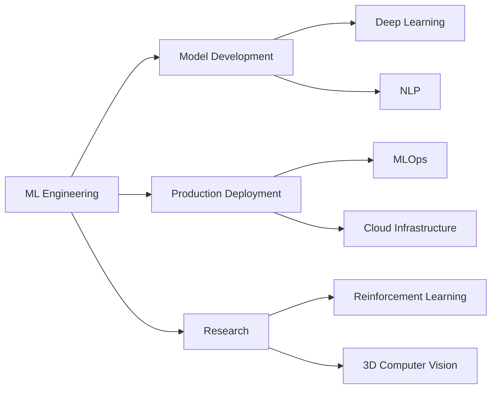

<div align="center">

# 👋 Hi, I'm Reiyo

### Machine Learning Engineer | AI Researcher | Open Source Contributor

[](https://oreiyo.space)
[](https://linkedin.com/in/reiyo06)
[](mailto:reiyo1113@gmail.com)


</div>

---

## 🚀 About Me

```python
class MachineLearningEngineer:
    def __init__(self):
        self.name = "Reiyo"
        self.role = "Machine Learning Engineer"
        self.location = "Gurugram, Haryana, India"
        self.focus_areas = [
            "Reinforcement Learning",
            "Advanced NLP",
            "3D Computer Graphics",
            "MLOps & Production ML"
        ]
        
    def current_work(self):
        return {
            "focus": "Building scalable ML systems",
            "exploring": ["RL Algorithms", "Transformer Architectures", "3D Vision"],
            "collaborating": "Open Source AI Projects"
        }
    
    def say_hi(self):
        print("Thanks for dropping by! Let's build something amazing together!")

me = MachineLearningEngineer()
me.say_hi()
```

- 🔭 Currently working on **production-scale machine learning systems**
- 🌱 Deep diving into **Reinforcement Learning, Advanced NLP, and 3D Computer Graphics**
- 👯 Open to collaborate on **innovative Open Source AI Projects**
- 💬 Ask me about **ML System Design, Deep Learning, and MLOps**
- 🎯 2025 Goal: **Contribute to cutting-edge AI research and open-source projects**

---

## 🛠️ Tech Stack

### Languages


### ML/DL Frameworks


### MLOps & Cloud


### Web & Tools


---

## 📊 GitHub Statistics

<div align="center">
  
  
</div>

<div align="center">
  
  
</div>

---

## 📈 Contribution Graph

<div align="center">
  
</div>

---

## 🏆 GitHub Trophies

<div align="center">
  
</div>

---

## 📌 Pinned Repositories

<div align="center">
  <a href="https://github.com/RyoK3N">
    
  </a>
  <a href="https://github.com/RyoK3N">
    
  </a>
</div>

---

## 💼 Experience Highlights



---

## 🎯 Current Focus

- 🧠 **Reinforcement Learning**: Implementing advanced RL algorithms for complex decision-making systems
- 🗣️ **Advanced NLP**: Building transformer-based models for specialized language tasks
- 🎨 **3D Computer Graphics**: Integrating ML with 3D rendering and computer vision
- ⚙️ **MLOps**: Designing scalable, production-ready ML pipelines

---

## 📝 Latest Blog Posts

<!-- BLOG-POST-LIST:START -->
- Coming soon on [oreiyo.space](https://oreiyo.space)
<!-- BLOG-POST-LIST:END -->

---

## 🤝 Let's Connect

<div align="center">
  
[](https://oreiyo.space)
[](https://linkedin.com/in/reiyo06)
[](https://github.com/RyoK3N)
[](mailto:reiyo1113@gmail.com)

</div>

---

<div align="center">
  
### 💡 "Merging technology with creativity to build intelligent systems"


**⭐️ From [RyoK3N](https://github.com/RyoK3N) | Open to collaborations and interesting projects!**

</div>

